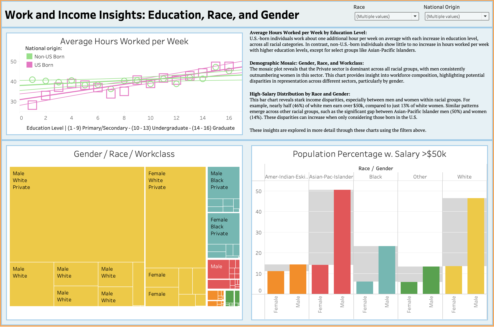

This folder contains analyses and modeling based on the UCI Adult Income dataset, exploring various demographic factors related to income, education, and employment using clustering and statistical analysis techniques. The dataset was taken from Kaggle (https://www.kaggle.com/datasets/armanmanteghi/data-analytics-with-python-with-demographics) which itself came from the UC Irvine Machine Learning Repository (https://archive.ics.uci.edu/dataset/2/adult). The files included are:

AdultData_KModes.ipynb - Performs K-Modes clustering on the Adult dataset, focusing on categorical variables like workclass, education, and race.

AdultData_PostgreSQLAnalysis.ipynb - Walks through a comprehensive SQL analysis of the Adult dataset using PostgreSQL. This notebook performs various data exploration tasks, including summarizing categorical variables and calculating distributions across demographic groups.

adult_data.csv - The cleaned dataset used in the analyses.

adult_demographics_analysis_R.pdf - A report on demographic analysis, primarily focusing on the relationship between variables like education, workclass, and income, using R for statistical modeling and visualization.

The Tableau dashboard was saved to the Tableau Public Server and can be found at https://tinyurl.com/bdej24j2.

