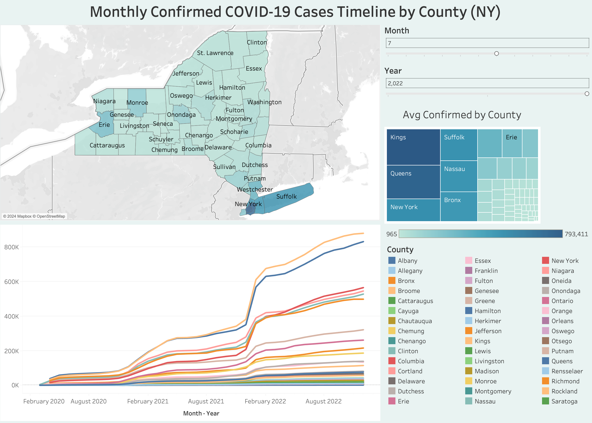
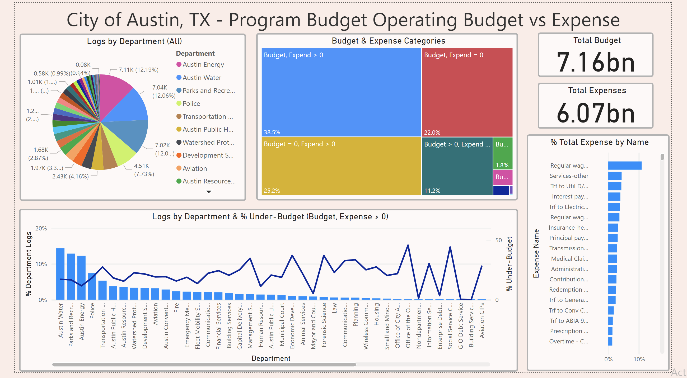

# Overview

This repository showcases a variety of data analysis and machine learning projects using different datasets across multiple domains. Each project folder contains datasets (either explicitly or source links) and comprehensive analyses using SQL, Python, and/or R, and has an associated dashboard with links (when using Tableau Public) and screenshots present in each folder (Tableau / Power BI). The SQL analyses are walked through largely using Jupyter Notebook with [jupysql](https://github.com/ploomber/jupysql) for ease of reading reading and querying. Here's an overview:

- **Top 1500 Steam Games 2024**:
Analysis of the top 1500 selling games on Steam from Q1, Q2, and Q3 of 2024. The project includes SQL-based exploratory data analysis (SQLite), statistical modeling in R, and machine learning to predict publisher class based on revenue, price, and playtime. A visualization of statistics across different publisher classes using Tableau is available.

- **Austin TX Budgets and Expenses Analysis**:
Investigates the budgetary and expenditures logs of the city of Austin, TX during Q3 2024 using Microsoft Azure services. The analysis involves SQL queries (SQL server) for data exploration and clustering techniques (K-Prototypes and Agglomerative Clustering) for grouping budgets and expenditures. The project also includes a Power BI dashboard for visual insights.

- **Bing COVID-19 Analysis**:
Modeling and analysis of COVID-19 statistics from the Bing COVID-19 dataset, focusing on data imputation using machine learning techniques (Gaussian processes, random forests, knn, polynomial regression) for national-level United States Covid statistics and SQL-based (SQL Server) investigation. Visualizations were created using Tableau to explore the data at the county level for the state of New York.

- **Adult Income Analysis**:
Analysis of the UCI Adult Income dataset, focusing on demographic factors related to income, education, employment, gender, and others. Techniques include clustering with K-Modes, SQL data exploration (PostgreSQL), and statistical modeling in R. A Tableau dashboard was created to visualize key insights related to income distributions and hours worked per week across demographic groups.

# Example Dashboard Visualizations

*Adult Income Dataset*

*Covid-19 statistics for NY counties from March 2020 to December 2022.*

*Budgetary and Expenditure statistics from public departments of Austin, TX for Q3 of 2024.*

