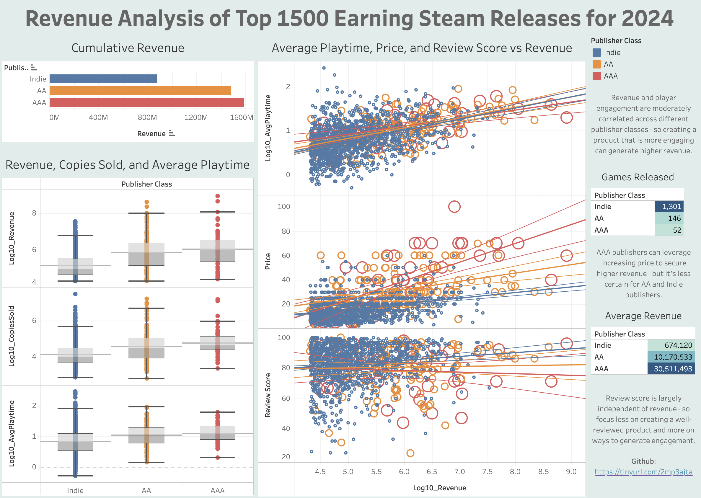

This folder contains the original dataset taken straight from Kaggle (https://www.kaggle.com/datasets/alicemtopcu/top-1500-games-on-steam-by-revenue-09-09-2024/data) and all the subsequent analyses and cleaned data that follows. Specifically, the correspondence for the files are:

1. Steam_2024_bestRevenue_1500.csv - The original dataset in .csv format

2. Steam_sales_SQL_analysis.ipynb - Jupyter notebook that does some EDA of the dataset using SQL(-Lite, specifically)

3. steam_revenue_cleaned.csv - The cleaned dataset resulting from the SQL EDA. Removed 1 data point (the point corresponding to the 'Hobbyist' publisher class) and replaced reviewScores of 0 with Null.

4. steam_revenue_R_analysis.Rmd - R markdown document detailing the proper statistical analysis of the cleaned dataset in R.

5. steam_revenue_R_analysis.pdf - PDF version of the HTML document generated from the *.Rmd file in R Studio. If you want to read through the statistical analysis results with plots, look at this.

6. Steam_sales_ML_prediction.ipynb - Jupyter notebook that trains linear, ML, and ensemble-ML models in order to predict publisher class using only revenue, price, and average playtime per game.

A Tableau dashboard of this dataset can be found on the Tableau Public server at https://tinyurl.com/3f3yyydu.

